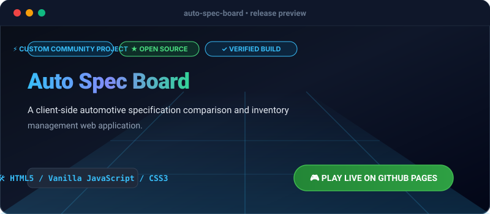

# Auto Spec Board

[](https://olamideakinade.github.io/auto-spec-board/)
[](https://github.com/Olamideakinade/auto-spec-board)
[](https://opensource.org/licenses/MIT)



> 🚀 **Live Demo Available:** Test and play this project live right now: **[https://olamideakinade.github.io/auto-spec-board/](https://olamideakinade.github.io/auto-spec-board/)**

Auto Spec Board is a lightweight, zero-dependency client-side web application designed for comparing automotive technical specifications, tracking vehicle inventory, and managing filterable feature matrices directly in the browser.

## Key Capabilities

- **Side-by-Side Comparison**: Compare up to four vehicles across performance, dimensions, and powertrain specifications.
- **Dynamic Filtering**: Filter inventory instantly by make, body style, price ceiling, and horsepower thresholds.
- **Local Persistence**: All custom vehicle entries and comparison states persist locally via the browser storage API.
- **Export Utility**: Export filtered datasets or comparison sheets to structured JSON or CSV format.

## Quickstart

Clone the repository and open `index.html` in any modern web browser or serve via a local static file server:

```bash
git clone https://github.com/Olamideakinade/auto-spec-board.git
cd auto-spec-board
python3 -m http.server 8080
```

Open `http://localhost:8080` in your browser.

## Architecture & Design

Built entirely with vanilla web standards:
- **`index.html`**: Semantic layout structured for responsive grid view and modal management.
- **`style.css`**: Design system utilizing CSS custom properties, grid/flexbox layouts, and system typography without external UI frameworks.
- **`app.js`**: Modular state container handling filtering algorithms, local storage synchronization, and DOM diffing.

## License

MIT